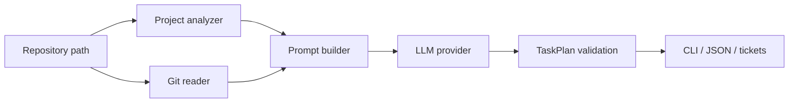

# How nxdo works

`nxdo` turns **project state + git history + your question** into a validated list of **10 engineering tasks**. This page walks through the pipeline step by step and shows a real run on the nxdo repository itself.

## Pipeline overview



| Step | Module | What happens |
|------|--------|--------------|
| 1 | `nxdo.project_analyzer` | Reads README, manifests, directory tree, stack hints |
| 2 | `nxdo.git_reader` | Loads recent commits, changed files, TODO/FIXME markers |
| 3 | `nxdo.metrics` *(optional)* | Complexity, coupling, hotspots, bus factor |
| 4 | `nxdo.koru_context` *(optional)* | Open planfile tickets and Koru operations |
| 5 | `nxdo.llm_client` | Builds the user prompt from all context |
| 6 | `nxdo.providers` | Calls an OpenAI-compatible API (OpenRouter by default) |
| 7 | `nxdo.models` | Validates JSON into `TaskPlan` with 10 `Task` items |
| 8 | `nxdo.output` / `nxdo.ticket_generator` | Renders text, JSON, TODO.md, or `.planfile/` |

## Step-by-step: analyze nxdo with nxdo

These commands were run on **2026-06-16** against `/home/tom/github/semcod/nxdo` (the nxdo source repo).

### Step 0 — Install and configure

```bash
pip install nxdo
export OPENROUTER_API_KEY="your-key"   # or OPENAI_API_KEY
# optional overrides:
# export LLM_MODEL="openrouter/qwen/qwen3-coder-next"
# export MAX_COMMITS=10
```

### Step 1 — Inspect context (no LLM call)

See exactly what nxdo will send to the model:

```bash
nxdo print-context . --max-commits 5
```

**Expected:** project name `nxdo`, Python stack, README excerpt, recent commits, changed files.

Sample output: [examples/nxdo-self-context.txt](../examples/nxdo-self-context.txt)

### Step 2 — Preview the LLM prompt

```bash
nxdo print-prompt . -e "What should we build next after the lane→nxdo rename?"
```

**Expected:** a single text block combining snapshot + git context + your extra question.

### Step 3 — Code metrics (no LLM call)

Find complexity hotspots and coupling before planning:

```bash
nxdo metrics . --top 5
```

**Observed on nxdo (2026-06-16):**

- Highest complexity: `src/nxdo/metrics/complexity.py`, `hotspots.py`, `tests/test_cli.py`
- Bug hotspots: `cli.py`, `ticket_generator.py`, `project_analyzer.py`
- Useful for prioritizing refactors before feature work

Sample output: [examples/nxdo-self-metrics.txt](../examples/nxdo-self-metrics.txt)

### Step 4 — Generate a 10-task plan

```bash
nxdo plan . \
  -e "After renaming lane to nxdo, what are the next sensible engineering steps?" \
  --max-commits 10
```

**Expected:** Rich table with 10 tasks (type, priority, estimate, acceptance criteria).

**Observed summary:** nxdo correctly detected recent docs/testing/rename work and proposed sensible follow-ups: CLI hardening (`python -m nxdo` subcommands), docs refresh, error handling, integration tests, planfile docs, TODO cleanup.

Sample JSON: [examples/nxdo-self-plan.json](../examples/nxdo-self-plan.json)

Save JSON yourself:

```bash
nxdo plan . -e "Your focus here" --json > my-plan.json
nxdo validate my-plan.json
```

### Step 5 — Turn plan into tickets *(optional)*

```bash
# Preview tickets in terminal
nxdo tickets . -e "Focus on CLI and documentation"

# Sync to .planfile/ for Koru / planfile workflows
nxdo tickets . --koru-aware --sync-planfile

# One-shot: metrics + plan + sync
nxdo auto . -e "Stabilize CLI after rename"
```

### Step 6 — Execute elsewhere

After `--sync-planfile`, run your usual planfile/Koru loop:

```bash
planfile apply
# or
koru --queue --loop
```

## What makes a “good” plan?

nxdo works best when the repository has:

- A readable **README** and **manifest** (`pyproject.toml`, etc.)
- **Git history** with meaningful commit messages
- **TODO/FIXME** markers or an existing `TODO.md`
- Optional: `.planfile/` for Koru-aware ticket linking

If git history is empty, the model still plans — but tasks tend to be generic bootstrap chores. Always run `print-context` first to verify nxdo sees your repo correctly.

## Commands quick reference

| Command | LLM? | Purpose |
|---------|------|---------|
| `print-context` | No | Snapshot + git context |
| `print-prompt` | No | Full prompt preview |
| `metrics` | No | Complexity / coupling / hotspots |
| `plan` | Yes | 10-task engineering plan |
| `validate` | No | Check saved JSON plan |
| `tickets` | Yes | Plan + optional planfile/TODO sync |
| `auto` | Yes | Metrics-aware plan + `.planfile/` sync |

See also: [CLI details in README](../README.md#cli-reference) · [examples/](../examples/)

## Python API

```python
from pathlib import Path
from nxdo.planner import generate_next_tasks
from nxdo.providers import OpenAICompatProvider
from nxdo.config import get_settings

plan = generate_next_tasks(
    repo_path=Path("."),
    extra_context="Improve test coverage for CLI",
    provider=OpenAICompatProvider(settings=get_settings()),
    settings=get_settings(),
)
print(plan.summary)
for task in plan.tasks:
    print(task.number, task.title, task.priority)
```

## Troubleshooting

| Symptom | Cause | Fix |
|---------|-------|-----|
| `python -m nxdo metrics` runs **plan** instead | Old `__main__` shim | Upgrade to nxdo ≥ 0.2.24 or use `nxdo metrics` entry point |
| Plan mentions wrong project name | First CLI arg treated as repo | Use `nxdo plan .` not `nxdo plan metrics` |
| `Error: No API key` | Missing env var | Set `OPENROUTER_API_KEY` or `OPENAI_API_KEY` |
| Generic “init git repo” tasks | Empty or shallow git history | Commit work first; increase `--max-commits` |
