# System Architecture Analysis
<!-- generated in 0.00s -->

## Overview

- **Project**: /home/tom/github/semcod/lane
- **Primary Language**: python
- **Languages**: python: 19, yaml: 4, txt: 1, shell: 1, toml: 1
- **Analysis Mode**: static
- **Total Functions**: 111
- **Total Classes**: 17
- **Modules**: 26
- **Entry Points**: 26

## Architecture by Module

### src.lane.git_reader
- **Functions**: 21
- **Classes**: 2
- **File**: `git_reader.py`

### src.lane.project_analyzer
- **Functions**: 20
- **Classes**: 1
- **File**: `project_analyzer.py`

### src.lane.cli
- **Functions**: 14
- **File**: `cli.py`

### src.lane.ticket_generator
- **Functions**: 12
- **File**: `ticket_generator.py`

### src.lane.providers.openai_compat
- **Functions**: 8
- **Classes**: 1
- **File**: `openai_compat.py`

### src.lane.metrics.complexity
- **Functions**: 8
- **Classes**: 1
- **File**: `complexity.py`

### src.lane.koru_context
- **Functions**: 6
- **Classes**: 3
- **File**: `koru_context.py`

### src.lane.metrics.hotspots
- **Functions**: 5
- **Classes**: 1
- **File**: `hotspots.py`

### src.lane.models
- **Functions**: 4
- **Classes**: 4
- **File**: `models.py`

### src.lane.llm_client
- **Functions**: 4
- **Classes**: 1
- **File**: `llm_client.py`

### src.lane.output
- **Functions**: 3
- **File**: `output.py`

### src.lane.metrics.coupling
- **Functions**: 3
- **Classes**: 1
- **File**: `coupling.py`

### src.lane.providers.base
- **Functions**: 1
- **Classes**: 1
- **File**: `base.py`

### src.lane.config
- **Functions**: 1
- **Classes**: 1
- **File**: `config.py`

### src.lane.planner
- **Functions**: 1
- **File**: `planner.py`

## Key Entry Points

Main execution flows into the system:

### src.lane.cli.cmd_metrics
> Display code metrics: complexity, coupling, hotspots.
- **Calls**: app.command, typer.Argument, typer.Option, typer.Option, repo.resolve, console.print, console.print, src.lane.metrics.complexity.collect_file_metrics

### src.lane.cli.cmd_auto
> Auto-generate and sync tickets for the most important work.

This command automatically:
1. Analyzes the project for high-priority issues (hotspots, c
- **Calls**: app.command, typer.Argument, typer.Option, typer.Option, repo.resolve, console.print, console.print, src.lane.metrics.hotspots.identify_bug_hotspots

### src.lane.cli.cmd_tickets
> Generate tickets from a plan using planfile integration.
- **Calls**: app.command, typer.Argument, typer.Option, typer.Option, typer.Option, typer.Option, typer.Option, typer.Option

### src.lane.cli.main
> Compatibility shim — maps legacy argparse argv to Typer sub-commands.
- **Calls**: argparse.ArgumentParser, parser.add_argument, parser.add_argument, parser.add_argument, parser.add_argument, parser.add_argument, parser.add_argument, parser.add_argument

### src.lane.cli.cmd_plan
> Generate a 10-task plan for the repository.
- **Calls**: app.command, typer.Argument, typer.Option, typer.Option, typer.Option, typer.Option, typer.Option, src.lane.config.get_settings

### src.lane.cli.cmd_print_context
> Print the assembled project and git context (no LLM call).
- **Calls**: app.command, typer.Argument, typer.Option, typer.Option, src.lane.project_analyzer.analyze_project, src.lane.git_reader.read_git_context, snapshot.to_text, git_ctx.to_text

### src.lane.cli.cmd_print_prompt
> Print the full prompt that would be sent to the LLM.
- **Calls**: app.command, typer.Argument, typer.Option, typer.Option, src.lane.project_analyzer.analyze_project, src.lane.git_reader.read_git_context, src.lane.llm_client.build_user_prompt, print

### src.lane.providers.openai_compat.OpenAICompatProvider._call_api
- **Calls**: retry, ValueError, src.lane.koru_context.get_koru_system_prompt_extension, httpx.Client, client.post, response.json, None.strip, retry_if_exception_type

### src.lane.models.TaskPlan.__str__
- **Calls**: None.join, lines.append, lines.append, lines.append, lines.append, str, lines.append, None.join

### src.lane.metrics.hotspots.get_critical_bus_factor_files
> Get files with critical bus factor (1-2 authors) + their authors.

Returns:
    [(file_path, author_count, [author_names]), ...]
- **Calls**: bus_factors.items, critical.sort, src.lane.metrics.hotspots.calculate_bus_factor, subprocess.run, list, critical.append, set, line.strip

### src.lane.cli.cmd_validate
> Validate a saved JSON plan file against the TaskPlan schema.
- **Calls**: app.command, typer.Argument, console.print, json.loads, TaskPlan.model_validate, plan_file.read_text, err_console.print, typer.Exit

### src.lane.git_reader.GitContext.to_text
- **Calls**: None.join, lines.append, lines.append, lines.append, lines.append, lines.append, len

### src.lane.models.Task.__str__
- **Calls**: self.task_type.value.upper, int, int

### src.lane.git_reader.CommitInfo.__str__
- **Calls**: None.join, len, len

### src.lane.llm_client.OpenAICompatibleLLMClient.__init__
- **Calls**: OpenAICompatProvider, os.environ.get, os.environ.get

### src.lane.project_analyzer.ProjectSnapshot.to_text
- **Calls**: self.file_contents.items, None.join, None.join

### src.lane.llm_client.OpenAICompatibleLLMClient.generate_task_plan
- **Calls**: src.lane.llm_client.build_user_prompt, self._provider.generate_plan

### src.lane.providers.openai_compat.OpenAICompatProvider.__init__
- **Calls**: None.rstrip, src.lane.config.get_settings

### src.lane.providers.openai_compat.OpenAICompatProvider.generate_plan
- **Calls**: self._call_api, src.lane.providers.openai_compat._parse_response

### src.lane.models.Task.to_dict
- **Calls**: self.model_dump

### src.lane.models.TaskPlan.to_dict
- **Calls**: task.to_dict

### src.lane.cli.app_entry
> Entry point used by the installed `lane` script.
- **Calls**: app

### src.lane.llm_client.parse_task_plan_response
> Parse a raw JSON string from the LLM into a TaskPlan. (Compatibility wrapper.)
- **Calls**: src.lane.providers.openai_compat._parse_response

### src.lane.providers.base.LLMProvider.generate_plan
> Send *user_prompt* to the model and return a validated TaskPlan.

### src.lane.metrics.complexity.get_high_complexity_files
> Filter files with high complexity or coupling.

### src.lane.metrics.complexity.get_poorly_typed_files
> Filter files with low type coverage.

## Process Flows

Key execution flows identified:

### Flow 1: cmd_metrics
```
cmd_metrics [src.lane.cli]
```

### Flow 2: cmd_auto
```
cmd_auto [src.lane.cli]
```

### Flow 3: cmd_tickets
```
cmd_tickets [src.lane.cli]
```

### Flow 4: main
```
main [src.lane.cli]
```

### Flow 5: cmd_plan
```
cmd_plan [src.lane.cli]
```

### Flow 6: cmd_print_context
```
cmd_print_context [src.lane.cli]
  └─ →> analyze_project
      └─> _collect_file_contents
          └─> _read_file_safely
          └─> _truncate_file_content
```

### Flow 7: cmd_print_prompt
```
cmd_print_prompt [src.lane.cli]
  └─ →> analyze_project
      └─> _collect_file_contents
          └─> _read_file_safely
          └─> _truncate_file_content
```

### Flow 8: _call_api
```
_call_api [src.lane.providers.openai_compat.OpenAICompatProvider]
  └─ →> get_koru_system_prompt_extension
```

### Flow 9: __str__
```
__str__ [src.lane.models.TaskPlan]
```

### Flow 10: get_critical_bus_factor_files
```
get_critical_bus_factor_files [src.lane.metrics.hotspots]
  └─> calculate_bus_factor
```

## Key Classes

### src.lane.providers.openai_compat.OpenAICompatProvider
> Provider for OpenRouter or any OpenAI-compatible endpoint.
- **Methods**: 3
- **Key Methods**: src.lane.providers.openai_compat.OpenAICompatProvider.__init__, src.lane.providers.openai_compat.OpenAICompatProvider.generate_plan, src.lane.providers.openai_compat.OpenAICompatProvider._call_api
- **Inherits**: LLMProvider

### src.lane.models.Task
- **Methods**: 2
- **Key Methods**: src.lane.models.Task.__str__, src.lane.models.Task.to_dict
- **Inherits**: BaseModel

### src.lane.models.TaskPlan
- **Methods**: 2
- **Key Methods**: src.lane.models.TaskPlan.__str__, src.lane.models.TaskPlan.to_dict
- **Inherits**: BaseModel

### src.lane.llm_client.OpenAICompatibleLLMClient
> Minimal client for OpenRouter or another OpenAI-compatible endpoint.

Kept for backwards compatibili
- **Methods**: 2
- **Key Methods**: src.lane.llm_client.OpenAICompatibleLLMClient.__init__, src.lane.llm_client.OpenAICompatibleLLMClient.generate_task_plan

### src.lane.providers.base.LLMProvider
> Interface every LLM backend must implement.
- **Methods**: 1
- **Key Methods**: src.lane.providers.base.LLMProvider.generate_plan
- **Inherits**: ABC

### src.lane.config.LaneSettings
> Runtime configuration loaded from environment variables.
- **Methods**: 1
- **Key Methods**: src.lane.config.LaneSettings.api_key
- **Inherits**: BaseSettings

### src.lane.git_reader.CommitInfo
- **Methods**: 1
- **Key Methods**: src.lane.git_reader.CommitInfo.__str__

### src.lane.git_reader.GitContext
- **Methods**: 1
- **Key Methods**: src.lane.git_reader.GitContext.to_text

### src.lane.project_analyzer.ProjectSnapshot
- **Methods**: 1
- **Key Methods**: src.lane.project_analyzer.ProjectSnapshot.to_text

### src.lane.models.Priority
- **Methods**: 0
- **Inherits**: str, Enum

### src.lane.models.TaskType
- **Methods**: 0
- **Inherits**: str, Enum

### src.lane.koru_context.KoruOperation
> A single koru operation available for task planning.
- **Methods**: 0

### src.lane.koru_context.KoruProjectState
> Current project state as seen by koru.
- **Methods**: 0

### src.lane.koru_context.KoruContext
> Full koru context for enriching the lane LLM prompt.
- **Methods**: 0

### src.lane.metrics.complexity.FileMetrics
> Comprehensive metrics for a source file.
- **Methods**: 0

### src.lane.metrics.hotspots.HotspotMetrics
> Bug hotspot metrics for a file.
- **Methods**: 0

### src.lane.metrics.coupling.CouplingMetrics
> Metrics for file pair coupling.
- **Methods**: 0

## Data Transformation Functions

Key functions that process and transform data:

### src.lane.cli.cmd_validate
> Validate a saved JSON plan file against the TaskPlan schema.
- **Output to**: app.command, typer.Argument, console.print, json.loads, TaskPlan.model_validate

### src.lane.git_reader._format_file_summary
> Format file frequency summary as a list of strings.
- **Output to**: sorted, file_freq.items

### src.lane.git_reader._parse_commit_metadata
> Parse a commit metadata line and return hash, author, date, message.
- **Output to**: line.split, len

### src.lane.git_reader._parse_commits
> Parse git log output into list of CommitInfo objects.
- **Output to**: log_raw.splitlines, src.lane.git_reader._finalize_commit, src.lane.git_reader._parse_commit_metadata, src.lane.git_reader._finalize_commit, line.strip

### src.lane.llm_client.parse_task_plan_response
> Parse a raw JSON string from the LLM into a TaskPlan. (Compatibility wrapper.)
- **Output to**: src.lane.providers.openai_compat._parse_response

### src.lane.koru_context._format_operations_for_llm
> Format koru operations as structured text for LLM prompt.
- **Output to**: lines.append, sorted, None.join, None.append, by_domain.items

### src.lane.koru_context._format_project_state_for_llm
> Format current koru project state for LLM prompt.
- **Output to**: lines.append, lines.append, lines.append, lines.append, None.join

### src.lane.project_analyzer._parse_pyproject_tomllib
> Parse pyproject.toml using tomllib if available.
- **Output to**: parsed.get, isinstance, tomllib.loads, project.get, project.get

### src.lane.project_analyzer._parse_pyproject_regex
> Parse pyproject.toml using regex fallback.
- **Output to**: re.search, re.search, name_match.group, description_match.group

### src.lane.project_analyzer._parse_pyproject
- **Output to**: src.lane.project_analyzer._parse_pyproject_tomllib, src.lane.project_analyzer._parse_pyproject_regex

### src.lane.project_analyzer._parse_package_json
- **Output to**: json.loads, data.get, data.get, path.read_text

### src.lane.project_analyzer._parse_cargo
- **Output to**: re.search, re.search, name_match.group, description_match.group

### src.lane.providers.openai_compat._parse_json_response
> Parse JSON from raw response with error handling.
- **Output to**: json.loads, isinstance, ValueError, ValueError, type

### src.lane.providers.openai_compat._parse_tasks_from_data
> Parse tasks from the response data.
- **Output to**: enumerate, data.get, tasks.append, src.lane.providers.openai_compat._create_task_from_dict

### src.lane.providers.openai_compat._parse_response
> Parse and validate the raw JSON response from the LLM.
- **Output to**: src.lane.providers.openai_compat._strip_markdown_fences, src.lane.providers.openai_compat._parse_json_response, src.lane.providers.openai_compat._parse_tasks_from_data, TaskPlan, data.get

## Public API Surface

Functions exposed as public API (no underscore prefix):

- `src.lane.cli.cmd_metrics` - 33 calls
- `src.lane.cli.cmd_auto` - 33 calls
- `src.lane.cli.cmd_tickets` - 28 calls
- `src.lane.cli.main` - 25 calls
- `src.lane.metrics.hotspots.identify_bug_hotspots` - 18 calls
- `src.lane.cli.cmd_plan` - 16 calls
- `src.lane.metrics.complexity.collect_file_metrics` - 16 calls
- `src.lane.output.render_plan` - 14 calls
- `src.lane.cli.cmd_print_context` - 14 calls
- `src.lane.metrics.hotspots.calculate_bus_factor` - 14 calls
- `src.lane.cli.cmd_print_prompt` - 13 calls
- `src.lane.metrics.coupling.collect_coupling_matrix` - 13 calls
- `src.lane.metrics.coupling.get_coupling_clusters` - 13 calls
- `src.lane.ticket_generator.sync_to_planfile` - 12 calls
- `src.lane.metrics.hotspots.get_critical_bus_factor_files` - 11 calls
- `src.lane.cli.cmd_validate` - 9 calls
- `src.lane.planner.generate_next_tasks` - 9 calls
- `src.lane.koru_context.build_koru_context` - 9 calls
- `src.lane.git_reader.read_git_context` - 8 calls
- `src.lane.git_reader.GitContext.to_text` - 7 calls
- `src.lane.ticket_generator.sync_to_todo_md` - 6 calls
- `src.lane.output.render_context` - 5 calls
- `src.lane.project_analyzer.analyze_project` - 5 calls
- `src.lane.output.render_plan_json` - 4 calls
- `src.lane.ticket_generator.export_to_planfile_yaml` - 4 calls
- `src.lane.project_analyzer.ProjectSnapshot.to_text` - 3 calls
- `src.lane.llm_client.OpenAICompatibleLLMClient.generate_task_plan` - 2 calls
- `src.lane.ticket_generator.task_plan_to_tickets` - 2 calls
- `src.lane.providers.openai_compat.OpenAICompatProvider.generate_plan` - 2 calls
- `src.lane.models.Task.to_dict` - 1 calls
- `src.lane.models.TaskPlan.to_dict` - 1 calls
- `src.lane.config.get_settings` - 1 calls
- `src.lane.cli.app_entry` - 1 calls
- `src.lane.llm_client.build_user_prompt` - 1 calls
- `src.lane.llm_client.parse_task_plan_response` - 1 calls
- `src.lane.providers.base.LLMProvider.generate_plan` - 0 calls
- `src.lane.koru_context.get_koru_system_prompt_extension` - 0 calls
- `src.lane.metrics.complexity.get_high_complexity_files` - 0 calls
- `src.lane.metrics.complexity.get_poorly_typed_files` - 0 calls

## System Interactions

How components interact:

```mermaid
graph TD
    cmd_metrics --> command
    cmd_metrics --> Argument
    cmd_metrics --> Option
    cmd_metrics --> resolve
    cmd_auto --> command
    cmd_auto --> Argument
    cmd_auto --> Option
    cmd_auto --> resolve
    cmd_tickets --> command
    cmd_tickets --> Argument
    cmd_tickets --> Option
    main --> ArgumentParser
    main --> add_argument
    cmd_plan --> command
    cmd_plan --> Argument
    cmd_plan --> Option
    cmd_print_context --> command
    cmd_print_context --> Argument
    cmd_print_context --> Option
    cmd_print_context --> analyze_project
    cmd_print_prompt --> command
    cmd_print_prompt --> Argument
    cmd_print_prompt --> Option
    cmd_print_prompt --> analyze_project
    _call_api --> retry
    _call_api --> ValueError
    _call_api --> get_koru_system_prom
    _call_api --> Client
    _call_api --> post
    __str__ --> join
```



## Reverse Engineering Guidelines

1. **Entry Points**: Start analysis from the entry points listed above
2. **Core Logic**: Focus on classes with many methods
3. **Data Flow**: Follow data transformation functions
4. **Process Flows**: Use the flow diagrams for execution paths
5. **API Surface**: Public API functions reveal the interface

## Context for LLM

Maintain the identified architectural patterns and public API surface when suggesting changes.